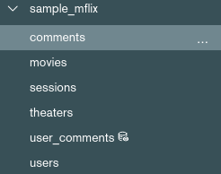

# Retos sesión 6

## Reto 1: Agrupamientos
Con base en el ejemplo 1, modifica el agrupamiento para que muestre el costo promedio por habitación por país de las propiedades de tipo casa.

```
[{$match: {
  property_type:"House", 
  bedrooms: {$gte: 1}
}}, {$addFields: {
  costo_por_cuarto: {
    $divide: ["$price","$bedrooms"]
  }
}}, {$group: {
  _id: "$address.country",
  num_cuartos: {
    $sum: 1
  }, 
  avg_price: {
    $avg: "$costo_por_cuarto"
  }
}}]
```

* * * 

## Reto 2: Asociación de colecciones
Usando las colecciones `comments` y `users`, se requiere conocer el correo y contraseña de cada persona que realizó un comentario. Construye un pipeline que genere como resultado estos datos.

De la colección `comments` unimos a la colección `movies`
```
[{$lookup: {
  from: 'users',
  localField: 'email',
  foreignField: 'email',
  as: 'user_array'
}}, {$addFields: {
  user_object: {$arrayElemAt: ["$user_array",0]}
}}, {$addFields: {
  email: "$user_object.email",
  password: "$user_object.password"
}}, {$project: {
  _id: 0,
  name: 1,
  email: 1,
  password: 1
}}]
```

También es posible unir de la colección `movies` a `comments` 
```
[{$lookup: {
  from: 'comments',
  localField: 'email',
  foreignField: 'email',
  as: 'comments_array'
}}, {$addFields: {
  num_comments: {$size: "$comments_array"}
}}, {$match: {
  num_comments: {$gte: 1}
}}, {$project: {
  _id: 0,
  email: 1,
  password: 1, 
  num_comments: 1
  }}]
```

* * * 

## Reto 3: Vistas 

