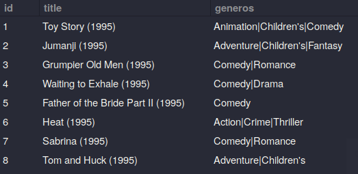
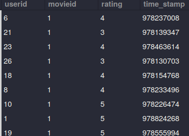
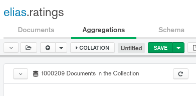
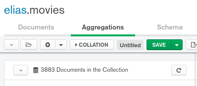

# Retos Sesion 7 

Para crear un servidor mysql usando una imagen de `mariadb` en docker
```linux
>> docker run --name ds-mariadb -p 3306:3306 -e MYSQL_ROOT_PASSWORD=[...] -d mariadb/server:10.3 
>> docker ps 
>> docker start ds-mariadb
>> docker cotainer logs ds-mariadb
>> 
```

## Reto 01 y 02: Crear las bases de datos `ratings` y `movies` en sql 
```mysql
# Crear una db
CREATE DATABASE IF NOT exists bedu;

# Seleccionar la db
USE bedu

# Crear la tabla ratings 
CREATE TABLE IF NOT EXISTS ratings (
   userid INT, 
   movieid INT, 
   rating INT, 
   time_stamp BIGINT
);

# Verificar la tabla ratings 
SELECT * FROM ratings ORDER BY movieid ASC LIMIT 10;

# Crear la tabla movies  
CREATE TABLE IF NOT EXISTS movies (
   id INT PRIMARY KEY, 
   title VARCHAR(80), 
   generos VARCHAR(80)
); 

# Verificar la tabla movies 
SELECT * FROM movies ORDER BY id LIMIT 10;
```






## Reto 3: Realizando operaciones con Colecciones e importando datos 
Agregando la base de datos `ratings` con 1000209



Agregando la base de datos `movies` con 3883 
 



